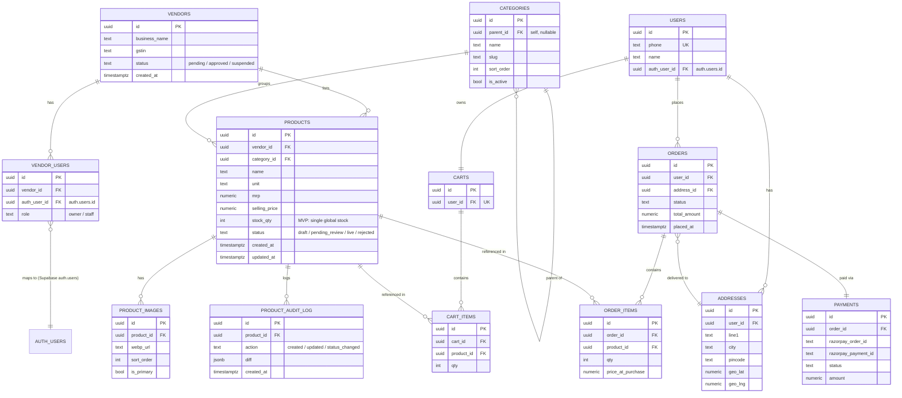
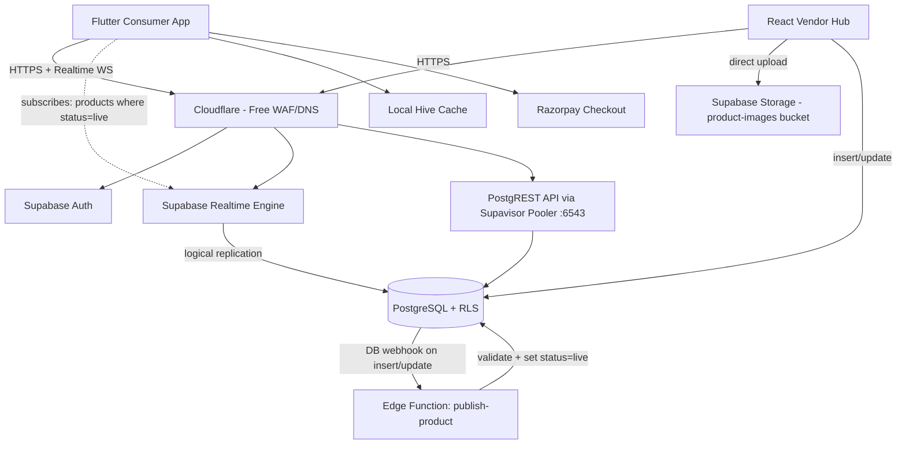

# Blinkit-Clone MVP — Tier A Implementation Plan
### Flutter (consumer app) + React (vendor/seller hub) + Supabase Cloud — 0 to 20,000 concurrent users

> This file is written to be handed directly to an AI coding agent (Antigravity or similar) as the spec. Each phase is scoped small on purpose — one phase = one agent session = one reviewable diff. Do not let the agent jump ahead to a later phase's code before the current phase's acceptance criteria are met.

---

## ⚡ Infrastructure Reality — Read This First

**Supabase is cloud-only in this project (free tier).** There is NO local Supabase Docker setup (`supabase start`) anywhere in the workflow.

| Tool | How it's used |
|---|---|
| **Supabase MCP server** | The AI agent applies migrations, runs SQL, deploys Edge Functions, and generates TypeScript types **directly against the cloud project** via the MCP tool suite (`apply_migration`, `execute_sql`, `deploy_edge_function`, `generate_typescript_types`, etc.) |
| **Supabase CLI** | Used ONLY for: `supabase functions deploy` (if MCP deploy is unavailable) and `supabase gen types` (fallback). Never for `supabase start` or `supabase db reset`. |
| **Supabase Dashboard** | Manual one-time config: Storage bucket creation, DB Webhook setup, Auth provider enabling. Everything else goes through MCP or CLI. |

> **No local Postgres. No `supabase start`. No `supabase db reset`.** All schema and seed operations target the cloud project via MCP `apply_migration` and `execute_sql`.

---

## 0. Ground Rules — Spec-Driven Development (avoiding AI slop)

These rules apply to **every** phase below, not just phase 0.

1. **One phase, one branch, one PR.** Never ask the agent to "build the whole app" in one shot — that's exactly how slop happens (duplicated logic, inconsistent state management, dead code).
2. **Write the spec before the code.** For every phase, create `docs/specs/phase-N-<name>.md` containing: goal, in-scope screens/files, out-of-scope (explicitly), acceptance criteria, and the exact folder paths that may be touched. Paste that spec to the agent as its task — don't paraphrase from memory.
3. **Freeze the folder structure first (Section 1).** An agent that's free to invent its own structure will invent a different one every session. Lock it in Phase 0 and reference it in every subsequent spec.
4. **One state-management pattern, chosen once.** Recommendation: **Riverpod** (compile-safe, testable, works cleanly with Supabase streams for realtime). Do not let the agent mix Provider/Bloc/GetX later "because it's simpler for this screen."
5. **Demo data has one source of truth.** Phase 1 uses a `DemoCatalogRepository` behind the same `CatalogRepository` interface that Phase 3 replaces with `SupabaseCatalogRepository`. The agent must never hardcode demo JSON directly inside a widget — that's the #1 cause of "looks done, isn't wired" slop.
6. **No silent scope creep.** If the agent proposes adding a screen/table/service not in the current phase's spec, that's a signal to stop and write a new spec — not to let it keep generating.
7. **Every phase ends with a working, runnable state.** Not "mostly working" — `flutter run` / `npm run dev` must succeed with no red screens before moving on.
8. **Security checklist (Section 9) is checked at the end of every phase**, not saved for a final audit.

---

## 1. Repository & Folder Structure (lock this in before any code)

Three repos (or a monorepo with three top-level folders — either works, keep them decoupled):

### 1.1 Flutter consumer app

```
blinkit_clone_app/
├── lib/
│   ├── main.dart
│   ├── app.dart                        # MaterialApp, theme, router
│   ├── core/
│   │   ├── config/
│   │   │   └── env.dart                # SUPABASE_URL / ANON_KEY from --dart-define
│   │   ├── network/
│   │   │   └── supabase_client.dart    # single Supabase.instance init
│   │   ├── cache/
│   │   │   ├── hive_service.dart       # Hive.init, box registration
│   │   │   └── cache_keys.dart
│   │   ├── theme/
│   │   ├── constants/
│   │   ├── utils/
│   │   └── widgets/                    # shared dumb widgets only
│   ├── features/
│   │   ├── home/
│   │   │   ├── data/                   # CatalogRepository + impls
│   │   │   ├── models/                 # Product, Category (freezed/json_serializable)
│   │   │   └── presentation/
│   │   │       ├── screens/
│   │   │       ├── widgets/
│   │   │       └── providers/          # Riverpod providers/notifiers
│   │   ├── catalog/                    # category grid, product listing (realtime)
│   │   ├── product_detail/
│   │   ├── cart/
│   │   ├── checkout/
│   │   ├── auth/                       # OTP login + onboarding
│   │   ├── orders/
│   │   └── profile/
│   └── routing/
│       └── app_router.dart             # go_router
├── test/
├── .env.example
└── pubspec.yaml
```

**Rule:** a feature folder never imports another feature folder's `data/` or `providers/` directly — only through a shared model/interface in `core/`. This is what keeps "add a new microservice/feature later" from becoming a rewrite.

### 1.2 React vendor/seller hub

```
vendor-hub-web/
├── src/
│   ├── main.tsx
│   ├── app/                            # routing, layout shell
│   ├── lib/
│   │   ├── supabaseClient.ts
│   │   └── imageCompression.ts         # browser-image-compression -> WebP
│   ├── features/
│   │   ├── auth/                       # Google OAuth, onboarding
│   │   ├── catalog/                    # product create/edit forms, listing
│   │   ├── categories/
│   │   └── dashboard/
│   ├── components/                     # shadcn/ui-based shared components
│   ├── hooks/
│   └── types/
│       └── database.types.ts           # generated via `supabase gen types typescript`
├── public/
├── .env.example
└── package.json
```

### 1.3 Supabase project

```
supabase/
├── migrations/                         # timestamped .sql — never hand-edit prod schema
├── functions/                          # Edge Functions (Deno)
│   ├── publish-product/
│   ├── otp-guard/                      # rate-limit wrapper before Supabase Auth OTP
│   └── razorpay-webhook/               # added in a later phase
├── seed.sql                            # demo vendors/categories/products for local dev
└── config.toml
```

**Acceptance criteria for Phase 0:** all three trees exist (empty files with comments are fine), `flutter run` shows a blank scaffold, `npm run dev` shows a blank shell, `supabase start` runs locally with the empty migration folder.

---

## 2. Phase 1 — Flutter Home UI Screens (demo data only)

**Goal:** Build the core consumer screens against a `DemoCatalogRepository`, zero Supabase calls yet. This is pure UI/UX — get it pixel-close to Blinkit before any backend exists, so later phases are "swap the data source," not "redesign the screen."

**Screens to build (in this order):**
1. Splash → location-permission prompt (mocked, just UI)
2. **Home screen** — top bar with delivery-address pill + search, horizontal category rail, banner carousel, "Grocery & Kitchen" / "Snacks" etc. product grids
3. Category listing screen (grid of subcategories → tapping opens product list)
4. Product listing screen (filters/sort UI, product cards with qty stepper)
5. Product detail screen
6. Cart screen (bottom sheet + full screen variant, like Blinkit's persistent cart bar)
7. Bottom nav shell (Home / Categories / Cart / Account)

**Data contract (freeze this now, it becomes the Postgres schema in Phase 2):**
```dart
class Category {
  final String id, name, imageUrl;
  final String? parentId;
}
class Product {
  final String id, name, unit, imageUrl, categoryId;
  final double mrp, sellingPrice;
  final bool inStock;
}
```
`DemoCatalogRepository` returns ~40 hardcoded products across 6 categories from a local JSON asset (`assets/demo/catalog.json`) — not inline in widgets.

**State management:** Riverpod `FutureProvider`/`StreamProvider` reading from `CatalogRepository` (interface) → `DemoCatalogRepository` (impl). This interface swap is the entire Phase-3 migration; no screen code should change.

**Acceptance criteria:**
- All 7 screens navigable via go_router, no dead-end buttons.
- Cart state (add/remove/qty) works in-memory via a Riverpod `StateNotifier` — not yet persisted.
- No widget directly references `DemoCatalogRepository` — only `CatalogRepository`.
- App runs on both Android and iOS simulators without layout overflow.

---

## 3. Phase 2 — Database Design & Supabase Configuration

### 3.1 ER Diagram (vendor-catalog model, Blinkit Seller-Hub–accurate)

Blinkit's real model: **brands/vendors upload product catalog metadata** (name, images, MRP, category) to a seller hub; Blinkit's own ops team owns **inventory per dark store** separately. Your MVP should mirror this split from day one — it's what lets you add dark-store inventory later without touching the vendor-facing schema at all.



**Why this shape, specifically:**
- `PRODUCTS.stock_qty` is a **single global column** in the MVP, not a per-dark-store `INVENTORY` table. This is deliberate — you have no dark stores yet. When you add them (Tier B), you add a new `INVENTORY (product_id, dark_store_id, qty, reserved_qty)` table and **migrate** `stock_qty` into it as the "default store" row — no breaking change to the vendor app, which never touches inventory-per-location anyway (that's Blinkit ops' job, not the brand's).
- `PRODUCTS.status` (`draft → pending_review → live/rejected`) is what the realtime sync in Phase 4 filters on — the consumer app only ever subscribes to `status = 'live'`.
- `PRODUCT_AUDIT_LOG` costs nothing now and saves you from an un-auditable catalog later — every vendor edit is traceable.
- `VENDOR_USERS` is separated from `VENDORS` because a real seller hub (like Blinkit's) supports multiple staff logins per business from day one — don't hardcode 1 login = 1 vendor.

### 3.2 Supabase configuration checklist

| Setting | What to do | Why |
|---|---|---|
| **Connection pooling** | Use the **Supavisor transaction-mode pooler** (port 6543) for all app/Edge Function connections. Use the **direct connection** (port 5432) only for running migrations. | This *is* your PgBouncer — Supabase runs it for you, you just have to point your connection string at the right port. Skipping this is the #1 cause of "works with 10 users, dies at 500." |
| **Realtime** | `ALTER PUBLICATION supabase_realtime ADD TABLE products;` and same for `categories`. Restrict via RLS (see below) so a client only *receives* rows it's allowed to `SELECT`. | This is your "sync microservice" at Tier A — native Postgres logical replication, zero extra infra. |
| **Row Level Security** | Enable RLS on **every** table, no exceptions, from the first migration. See policy table below. | Non-negotiable — this is your only authorization layer until you have a backend service layer. |
| **Storage buckets** | `product-images` bucket: public read, insert/update restricted to the uploading vendor's own `vendor_id` folder path (`{vendor_id}/{product_id}/{filename}`). | Path-based RLS on Storage is simpler to reason about than per-file ACLs. |
| **Auth providers** | Google OAuth enabled for the **vendor** project (or a separate Supabase project — see note below); Phone OTP enabled for the **consumer** app, backed by a real SMS provider (Twilio/MSG91) — Supabase's default test OTP does not work in production. | Budget for SMS provider cost even at Tier A — it's small (a few $/month at this volume) but not zero. |
| **Database backups** | Enable daily backups (on by default on paid plan) + note your RPO/RTO target even at this stage. | Cheap insurance, easy to forget until it's too late. |

> **One Supabase project or two?** Use **one** Supabase project for both apps at Tier A — same Postgres instance, same Realtime engine, separate RLS policies per role (`vendor` vs `consumer` claims via custom JWT claims or a `role` column joined at query time). Splitting into two projects only makes sense once you're sharding for Tier C+; it adds cross-project sync complexity you don't need yet.

**Key RLS policies (write these as actual SQL in Phase 2's migration, not left as prose):**

| Table | Policy | Rule |
|---|---|---|
| `products` | Vendor read/write own | `vendor_id IN (SELECT vendor_id FROM vendor_users WHERE auth_user_id = auth.uid())` |
| `products` | Public read | `status = 'live'` — for the consumer app's anon/authenticated role |
| `categories` | Public read | `is_active = true` |
| `categories` | Admin write | restricted to a service-role key used only from an Edge Function, never the client |
| `carts`, `cart_items`, `orders`, `addresses` | Owner-only | `user_id = auth.uid()` (via the `users.auth_user_id` join) |
| `payments` | No client access at all | reads/writes only via Edge Function using the service role key |

### 3.3 Tier A Architecture (this phase's target, to be implemented in Phase 3)



**Acceptance criteria for Phase 2:** migrations applied locally via `supabase db reset`, RLS policies pass a manual test (a second vendor's JWT cannot read/write another vendor's products), Realtime publication confirmed via `supabase db diff`.

---

## 4. Phase 3 — Backend: Real-Time Catalog Sync + APIs

**This is the "exactly what Blinkit does behind the scenes" phase**, scoped to what Tier A actually needs (no Kafka yet — that's Tier C).

### 4.1 The sync flow, step by step

1. Vendor (React) compresses image client-side to WebP (Section 6.2) → uploads to `product-images/{vendor_id}/{product_id}/...` in Supabase Storage.
2. Vendor submits the product form → **direct insert/update** to `products` table via Supabase client SDK (RLS-scoped to their `vendor_id`), status defaults to `pending_review`.
3. A **Database Webhook** (Supabase's built-in trigger-to-HTTP feature, `Database → Webhooks` in dashboard) fires on `INSERT/UPDATE` of `products` → calls the `publish-product` Edge Function.
4. `publish-product` Edge Function validates (required fields present, price > 0, at least one image) and flips `status → live` (or `rejected` with a reason written to `product_audit_log`). At Tier A, auto-approve if validation passes — no human review queue yet.
5. The `status → live` update is itself a row change on `products`, which **Realtime** picks up via logical replication and pushes to every subscribed client instantly.
6. Flutter app's `StreamProvider` (subscribed to `products` where `status = 'live'` and matching the user's visible categories) receives the change, updates the Riverpod state, **and** writes through to the Hive cache (Section 6.1) so it survives app restarts/offline.

This *is* the real-time sync microservice — implemented as one Edge Function + Postgres's native replication, not a custom service. That's the correct Tier A answer; don't over-build this into a message queue yet.

### 4.2 APIs needed at this phase

| API | How it's exposed | Notes |
|---|---|---|
| Product CRUD (vendor) | Supabase auto-generated PostgREST (via client SDK), RLS-scoped | No custom REST code needed |
| Product publish/validate | `publish-product` Edge Function | Only place with "business logic" |
| Category list (public) | PostgREST, RLS `is_active = true` | Cached client-side (Section 6.1) |
| Product realtime stream | Supabase Realtime channel | Subscribed per visible category to limit payload |
| Cart/Checkout | PostgREST direct (RLS owner-only) | No custom backend needed yet |
| OTP request | `otp-guard` Edge Function wrapping Supabase Auth OTP | Adds the rate-limit (Section 9) Supabase Auth doesn't give you by default |

**Acceptance criteria:** a product created in the vendor web app appears in the Flutter app's catalog **within ~1–2 seconds**, with no manual refresh, verified on two physical/simulator devices side by side.

---

## 5. Phase 4 — Auth Screens + Onboarding

### 5.1 Consumer app (Flutter)
- Phone-number entry screen → OTP screen (via `otp-guard` Edge Function, not calling Supabase Auth OTP directly from the client — see Section 9).
- Post-verification: name + optional email capture → creates row in `users` table linked to `auth.users.id`.
- Address onboarding (add first address, ideally with map-pin drop — can stub the map in Tier A and just take a text address + pincode).

### 5.2 Vendor hub (React)
- **Google OAuth** via Supabase Auth (`supabase.auth.signInWithOAuth({ provider: 'google' })`) — fastest to ship, avoids building password-reset flows yourself.
- Post-auth onboarding form: business name, GSTIN, category of business → creates `vendors` row (status `pending`) + `vendor_users` row linking `auth.uid()` as `owner`.
- Show a "your account is under review" state if `vendors.status = 'pending'` — even if you auto-approve everyone at Tier A, build the state now so adding real review later is a status-flip, not a rebuild.

**Acceptance criteria:** a new vendor can sign up with Google, land on a pending-review screen, and (for now) be manually flipped to `approved` via the Supabase dashboard to unlock the catalog screens.

---

## 6. Phase 5 — Vendor Catalog Upload Flow (full loop)

Build the actual product-create/edit form in React:
- Fields: name, category (dropdown from live `categories`), MRP, selling price, unit, up to 6 images.
- Image picker → compress to WebP client-side (Section 6.2) → show upload progress per image → on success, show live thumbnail.
- "Publish" button → insert/update `products` row → show a status chip (pending → live) that **itself updates via Realtime** once the Edge Function processes it, so the vendor sees their product go live without refreshing.
- Category browser on the consumer app must reflect new categories/products with no manual sync step — this is validated by Phase 4's flow, this phase is just the vendor-side UI wrapping it.

**Acceptance criteria:** a vendor can go from "no account" to "live product visible in the Flutter app" in one continuous flow, end to end, with no developer intervention.

---

## 7. Phase 6 — Performance Layer (explained + verified against device cost)

Your four requested techniques, confirmed correct for Tier A, with the "don't exhaust the device" caveats:

### 7.1 Client-side catalog cache — Hive
- **Correct approach.** Store `Category` and `Product` lists as Hive boxes keyed by category ID. On app start, render from Hive **immediately** (perceived-instant load), then reconcile with the live Realtime stream in the background.
- **Resource guardrail:** cap the Hive box size — don't cache the entire catalog indefinitely. Evict products not viewed in the last N days, or cap at ~500 products (a few hundred KB, trivial for any phone). Never cache full-resolution images in Hive — only URLs; let Flutter's own `CachedNetworkImage` handle image disk-caching (it already manages an LRU eviction policy, don't reinvent it).
- **This is not the same as a database** — it's a read-through cache. Never write cart/order state you can't afford to lose *only* to Hive; that still needs a Supabase write in Phase 3's flow.

### 7.2 Compress images to WebP on the vendor website — correct
- Use `browser-image-compression` (npm) client-side **before** upload: target ~150–300KB per image at WebP quality 75–80, resized to a max dimension (e.g. 1080px) — this is more than enough for mobile product cards/detail views.
- Doing this **before** upload (not server-side after) saves you Storage bandwidth and egress cost directly — this is the correct place to do it, not a Cloud Function afterward.

### 7.3 PgBouncer / Supabase connection pooler — correct, and already covered in Section 3.2
- Confirm your Flutter/React/Edge-Function connection strings all point at the **6543 pooler port**, not 5432, before load-testing (Phase 8). This one setting is the difference between Supabase surviving 20K concurrent and falling over at 2K.

### 7.4 Prefetch cart → checkout — correct, with a scope limit
- Blinkit's own engineering blog has described using resource hints (similar in spirit to `<link rel="prefetch">` on web) to have the next screen's data ready before navigation — the mobile equivalent is: **while the user is on the Cart screen**, kick off (don't block on) a background fetch of `addresses` + `delivery-slot` data needed for Checkout, using Riverpod's `ref.read(...).future` pattern, so it's already resolved by the time they tap "Proceed."
- **Resource guardrail — do this, don't do more:**
  - Only prefetch **one screen ahead**, never the whole navigation graph — prefetching Checkout *and* Order-tracking *and* Payment simultaneously is what actually drains battery/data.
  - Cancel the prefetch if the user backs out of Cart (use a `CancelToken` / dispose the Riverpod provider) — don't let it run to completion for a screen the user never opens.
  - Only prefetch on Wi-Fi or when `connectivity_plus` reports a good connection — skip it silently on metered/poor mobile data.
  - This is a **network-bound**, not CPU-bound, optimization — it costs a small amount of data, effectively zero CPU/battery if implemented as a single cheap query, so it's safe as scoped above.

---

## 8. Phase 7 — Firebase Cloud Messaging (minimal now, scalable later)

- Add FCM to the Flutter app (order-status updates only, at Tier A — no marketing push yet).
- Server side: a lightweight Edge Function `send-order-notification`, triggered by a Database Webhook on `orders.status` change, calls the FCM HTTP v1 API with the user's stored device token.
- Store device tokens in a `device_tokens (user_id, token, platform, updated_at)` table — refresh on every app launch (tokens rotate).
- **Note for future scale:** this single Edge Function is fine up to Tier B. At Tier C, this becomes its own "Notification Worker" service consuming from Kafka (as in the earlier architecture doc) — structure the function's logic as a pure `buildNotificationPayload(order) → send(token, payload)` pair now, so lifting it into a worker later is a copy-paste, not a rewrite.

---

## 9. Security Checklist — Applied at Every Phase, Not Just at the End

| # | Control | Where it's implemented | Phase |
|---|---|---|---|
| 1 | RLS enabled on every table, no exceptions | Migrations (3.2) | Phase 2 |
| 2 | Razorpay HMAC-SHA256 signature verified on every webhook; never trust client-reported payment status | `razorpay-webhook` Edge Function | Phase 3 (payments, added when checkout is built) |
| 3 | OTP requests rate-limited per phone number | `otp-guard` Edge Function + a `otp_attempts` counter table (or Upstash Redis if you want it outside Postgres) | Phase 4 |
| 4 | Cloudflare free-tier WAF rules (basic bot/SQLi/XSS filtering) at the edge | Cloudflare DNS in front of both the Flutter API endpoint and the vendor web app | Phase 0 infra setup |
| 5 | Never log full card/UPI details anywhere | Razorpay Checkout (hosted) keeps you in PCI-DSS SAQ-A scope — don't build a custom card form, ever | All phases |
| 6 | Vendor Storage uploads path-scoped (`{vendor_id}/...`) with RLS | Storage policies (3.2) | Phase 2 |
| 7 | Service-role key never shipped to any client (Flutter or React) — only used inside Edge Functions | Edge Function env vars, never `--dart-define` or `.env` bundled into a client build | Phase 3 onward |
| 8 | Idempotency key on order-creation endpoint | Edge Function checks a `client_request_id` unique constraint before inserting an order | Phase added with checkout |
| 9 | Audit log on every product status change | `product_audit_log` table (3.1) | Phase 2 |
| 10 | Google OAuth only (no custom password storage) for vendor accounts | Supabase Auth config | Phase 4 |

**Do this after every phase, not once at the end:** re-run the RLS test from Phase 2 (a second vendor/user's token must never read another's data) against whatever new tables that phase introduced.

---

## 10. Phase 8 — Load Testing Supabase at 20K–30K Concurrent (free tools, dev environment)

### 10.1 Tooling
- **k6** (free, open-source) — scriptable in JavaScript, the best fit here since Supabase's API is HTTP/WebSocket.
- Because a single machine cannot open 20–30K concurrent connections (OS ephemeral-port limits — see the earlier architecture doc), run k6 **distributed**: 3–5 small cloud VMs (Hetzner/DigitalOcean, ~$5–10/mo each, destroy after the test) each running a fraction of the virtual users, coordinated via a shared k6 test file and a common start time — or use **k6 Cloud's free trial tier** for a one-off test if you don't want to manage the VMs yourself.

### 10.2 What to actually test
| Scenario | What it validates |
|---|---|
| Ramp 100 → 20,000 VUs hitting the product-listing PostgREST endpoint over 5 minutes | Whether the Supavisor pooler (6543) holds up — watch Supabase dashboard's "Database → Connections" panel live during the run |
| 5,000 concurrent Realtime WebSocket connections subscribed to `products` | Realtime's concurrent-connection ceiling on your plan tier — this is usually the first thing to cap out, not Postgres itself |
| Checkout-flow script (cart read → order insert → payment webhook simulation) at 2,000 VUs | Write-path latency and any lock contention on `products.stock_qty` under concurrent decrement |
| Sustained (not ramping) 20,000 VUs for 15 minutes at a steady product-browse pattern | Whether the system degrades gracefully or falls over — this is the number that matters more than a spike test |

### 10.3 What to watch while it runs
- Supabase dashboard: DB CPU %, active connections vs pool size, Realtime concurrent connections, Storage bandwidth.
- k6's own output: p95/p99 latency, error rate — target **p95 < 300ms** on reads at this stage (Tier A doesn't need Tier C's <150ms yet).
- If Realtime connections cap out before Postgres does (likely, on Supabase's free/pro plans), that's your signal to either upgrade the Realtime add-on or start scoping subscriptions more narrowly (per-category channels instead of one global channel) — cheaper fix than upgrading the whole plan.

**Acceptance criteria for this phase:** a documented test report (`docs/load-test-results.md`) with the four scenarios' results, the pooler connection count observed, and a clear pass/fail against the p95 < 300ms target — this becomes the evidence for *when* to trigger the Tier A → Tier B migration (per the earlier architecture doc's Section 10).

---

## 11. Summary — Phase Order (do not reorder)

| Phase | Deliverable | Depends on |
|---|---|---|
| 0 | Repo/folder structure locked | — |
| 1 | Flutter home screens, demo data | 0 |
| 2 | ERD + Supabase schema + RLS + Tier A architecture | 0 |
| 3 | Realtime catalog sync + Edge Functions + APIs | 2 |
| 4 | Auth (OTP + Google OAuth) + onboarding screens | 2, 3 |
| 5 | Vendor catalog upload flow (full loop) | 3, 4 |
| 6 | Performance layer: Hive, WebP, pooler, prefetch | 1, 3, 5 |
| 7 | FCM notifications | 3 |
| 8 | Load test at 20–30K concurrent | 2, 3, 6 |

Security checklist (Section 9) is verified incrementally after **every** phase above, not as a separate final phase.